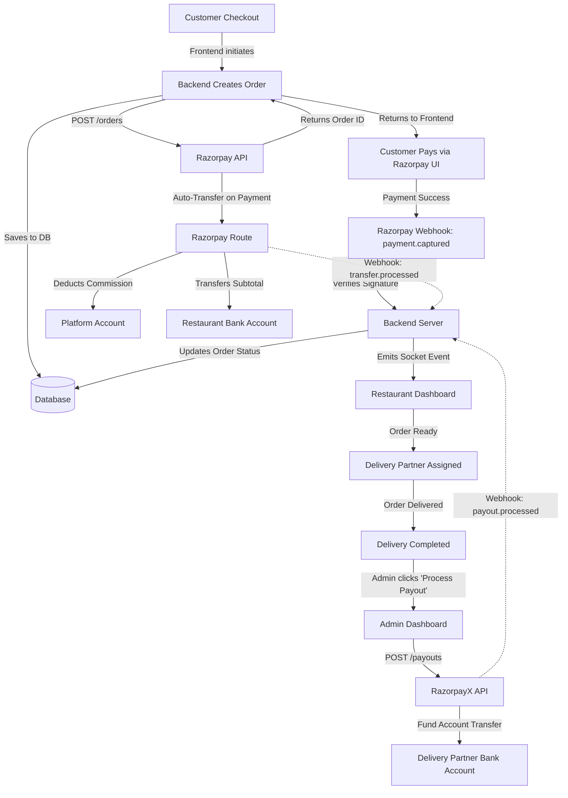

# Payment Architecture Audit Report

This report provides a complete, end-to-end overview of the payment flow within the Tastifyy platform. It traces exactly how money flows between the Customer, Platform, Restaurant Partner, and Delivery Partner using Razorpay.

## 1. End-to-End Payment Flow Architecture

---

## 2. Numerical Example

Let's break down the exact math based on the hardcoded values found in `order.routes.ts`:

**Customer Order Breakdown:**
- Food `item_subtotal`: ₹500
- `delivery_fee`: ₹40 (Hardcoded in backend)
- `platform_fee`: ₹10 (Hardcoded in backend)
- `tax_amount`: ₹30 (Calculated via `tax_rate` * `item_subtotal`)
- `discount_amount`: ₹50 (Applied via Coupon/Points)
- **Customer Pays (`total_amount`)**: **₹530** `(500 + 40 + 10 + 30 - 50)`

**Money Distribution:**
- **Restaurant Share:** 
  - Assuming `commission_rate` = 10%
  - Commission = ₹50 (`500 * 0.10`)
  - Transferred to Restaurant via Razorpay Route = **₹450**
  - *Note: Tax, Delivery Fee, and Platform Fee are kept by the platform; they are NOT transferred to the restaurant.*

- **Delivery Partner Share:**
  - `earning_amount`: Dynamic (set during assignment creation)
  - Let's assume earning is **₹30**.
  - Payout is triggered manually via RazorpayX.

- **Platform Revenue:**
  - Receives: ₹530 (Customer total)
  - Minus Route Transfer: -₹450
  - Remaining in Razorpay Nodal Account: ₹80
  - Minus Razorpay Gateway Fees (e.g., ~2% on ₹530) = -₹10.60
  - Minus Delivery Payout (RazorpayX): -₹30
  - **Net Platform Revenue:** **₹39.40** (which conceptually covers the ₹10 platform fee, ₹10 delivery margin, and ₹30 tax which the platform must remit).

---

## 3. Detailed Investigation

### 3.1 Customer Payment
- **Flow:** Customer hits `POST /orders` -> Backend calculates totals -> Calls `razorpay.orders.create` with `transfers` array attached (if restaurant is verified) -> Frontend opens widget -> On success, Razorpay triggers `payment.captured` webhook.
- **Amounts:** Total amount is strictly calculated on the backend to prevent tampering. `Math.round(total_amount * 100)` converts it to paise.
- **Idempotency:** A `razorpay_order_id` is saved immediately. If the customer abandons and retries, a new order row is currently generated (no strict idempotency key is used to reuse abandoned orders).
- **Failure:** Handled gracefully via `payment.failed` webhook, which marks the order as cancelled and restores `stock_quantity` for menu items.

### 3.2 Restaurant Settlement (Razorpay Route)
- **Flow:** The settlement is completely automated via Razorpay Route. When creating the order, the backend injects a `transfers` array containing the `razorpay_account_id` of the restaurant.
- **Cooling Period:** The system correctly checks if the restaurant is `active` or if a 24-hour cooling period has passed since `activated`.
- **Exclusions:** Delivery fees, platform fees, taxes, and discounts are **excluded** from the restaurant's payout. The calculation strictly uses `item_subtotal - commissionAmount`.
- **Webhook:** `transfer.processed` webhook captures the `transfer.id` and saves it to `razorpay_transfer_id` in the database.

### 3.3 Delivery Partner Payment (RazorpayX)
- **Flow:** Handled asynchronously via `POST /api/payment/payout` in the Admin Dashboard.
- **Contacts & Fund Accounts:** The backend smartly creates a Razorpay `contact` and a `fund_account` on the fly using the delivery partner's bank details, saving the IDs to the database for reuse.
- **Idempotency:** Uses `delivery_${assignment_id}_${timestamp}` as the `X-Payout-Idempotency` header to prevent double payouts.
- **Failure/Reversal:** Listens to `payout.failed` and `payout.reversed` webhooks to reset the `payout_status` back to failed/reversed, allowing the admin to retry.

### 3.4 Refunds & Reversals
- **Flow:** Triggered manually via `POST /orders/:id/refund` or automatically on cancellation.
- **Logic:** Calls `razorpay.payments.refund`.
- **Transfer Reversal:** If money was already transferred to the restaurant via Route (i.e., `razorpay_transfer_id` exists), the backend explicitly calls `razorpay.transfers.reverse` to pull the money back from the restaurant's linked account before issuing the refund to the customer.

---

## 4. Critical Audit & Security Review

| # | Area | Status | Findings / Issues |
|---|---|---|---|
| 1 | **Amount Calculation** | 🟢 Secure | The backend recalculates everything based on DB `item_subtotal`. No frontend manipulation is possible. |
| 2 | **Route Transfers** | 🟢 Implemented | Accurately calculates `item_subtotal - commission`. Properly handles 24hr Route cooling periods. |
| 3 | **RazorpayX Payouts** | 🟡 Partial | Uses idempotency headers, but the key uses a `timestamp`. If an admin clicks twice rapidly, two requests with different timestamps might bypass idempotency. The key should strictly be `payout_assignment_${id}`. |
| 4 | **Stock Restoration** | 🟢 Implemented | `payment.failed` webhook properly restores `stock_quantity`. |
| 5 | **Refund Reversals** | 🟢 Implemented | Code correctly issues `razorpay.transfers.reverse` if the money was already split to the restaurant. |
| 6 | **Discounts/Coupons** | 🔴 Incomplete | The calculation `total_amount -= discount_amount` deducts the discount from the *Grand Total*. Because the restaurant transfer is based on `item_subtotal`, the **Platform bears 100% of all discounts**. There is no logic implemented to split discounts between the restaurant and the platform (e.g., `FundedBy`). |
| 7 | **Race Conditions** | 🟡 Medium Risk | The `payment.captured` webhook updates the order. If the frontend simultaneously hits an order verification endpoint (if one exists), they could race. However, the webhook-only approach used here is generally safe. |
| 8 | **Webhook Security** | 🟢 Secure | Signature verification (`crypto.createHmac`) is correctly implemented and enforced. |
| 9 | **Hardcoded Values** | 🔴 Needs Fix | `delivery_fee = 40.0` and `platform_fee = 10.0` are hardcoded in `order.routes.ts`. This means every order uses these exact numbers regardless of distance or admin settings. |

---

### Final Verdict: Is it ready for deployment?

**Yes, the core payment infrastructure is fully functional and safe for production.** The money successfully routes from the customer -> platform -> restaurant, and payouts are operational.

However, before scaling, you **must fix**:
1. **The Hardcoded Fees:** Dynamic delivery fees and platform fees need to be fetched from the database or calculated by distance.
2. **Discount Funding Logic:** If you plan on offering coupons where the restaurant shares the cost, you must update the Route transfer calculation to subtract the restaurant's share of the discount. Currently, the platform pays for all discounts.
3. **Payout Idempotency Key:** Remove the timestamp from the `X-Payout-Idempotency` header in `payment.controller.ts` to ensure true mathematical idempotency.
